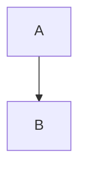

---

title: How to integrate MermaidJs in Laravel Application
slug: how-to-integrate-mermaidjs-in-laravel-application-98
date: 2023-02-20
category: Laravel
tags:
  - mermaidjs
  - markdown
  - md
  - laravel
image: "/src/content/images/default_image.jpeg"
excerpt: I have been using mermaid for a quite long time. Recently I feel interest to integrate mermaid in [Laravel](https://laravel.com), but there is no good tutorial how can you connect Mermaid in your laravel application. Therefore I am planning to write this article.
---

Hey everyone.

I have been using mermaid for a quite long time. Recently I feel interest to integrate mermaid in [Laravel](https://laravel.com), but there is no good tutorial how can you connect Mermaid in your laravel application. Therefore I am planning to write this article.

## What is mermaid?

[Mermaid](https://mermaid.js.org/intro/) is a JavaScript library for generating diagrams and flowcharts from simple text-based descriptions. It allows you to create diagrams using a simple and intuitive syntax that can be easily embedded in Markdown documents, code comments, and other text-based formats.

With Mermaid, you can create a wide range of diagrams, including flowcharts, sequence diagrams, Gantt charts, class diagrams, and more. You simply write the diagram description using Mermaid syntax, and Mermaid generates a SVG or PNG image of the diagram.

Read more: https://mermaid.js.org/

## How to integrate?

There are few ways to integrate, but for pragmatism, I pull the CDN directly into my application, so that I can avoid some unnecessary steps.

So, I just place this code block in my template where normally I try to display the mermaid graph.

```js
<script type="module">
    import mermaid from 'https://cdn.jsdelivr.net/npm/mermaid@8/dist/mermaid.esm.min.mjs';
    mermaid.initialize({
        startOnLoad: true,
        theme: 'default'
    });
</script>
```

Please take a note that `mermaid.initialize({ startOnLoad: true, theme: 'default' });` initializes the Mermaid library with some configuration options.
The startOnLoad option specifies that the Mermaid library should start generating diagrams as soon as the page is loaded.
The theme option specifies the default theme to use for the diagrams.
If you want to use different theme, you can choose whatever theme you want to use from there documentation: https://mermaid.js.org/config/theming.html

## How to use mermaid in your article?

I expect if I use mermaid graph like this way, it should work:



Unfortunately it does not work. Therefore I choose a tricky solution for that.
If I use `<div>` tag here, it should work.

<div class="mermaid">
graph TB;
A --> B
</div>

## Tweaking CSS (optional)
It you use any dark theme for markdown css, it might be overlapping with black background which does not looks good.

Therefore I just add extra css in my blade template.

```css
pre.mermaid {
    background-color: white !important;
}
```

That's it. It should work as expected.

Feel free to share your comments. :)